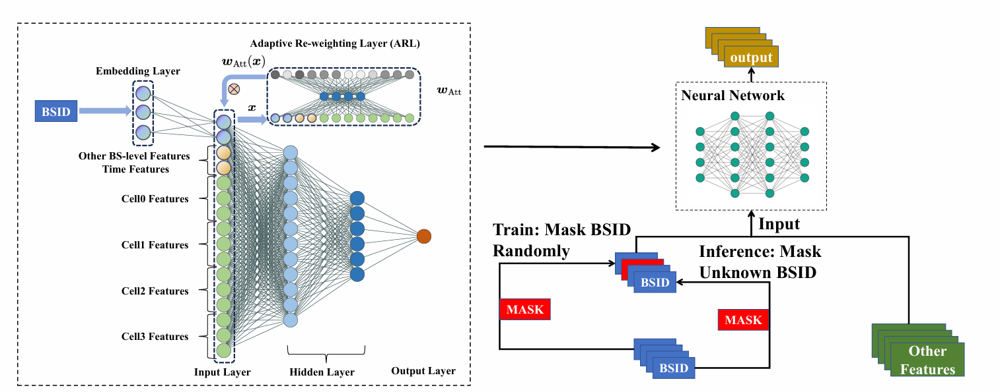
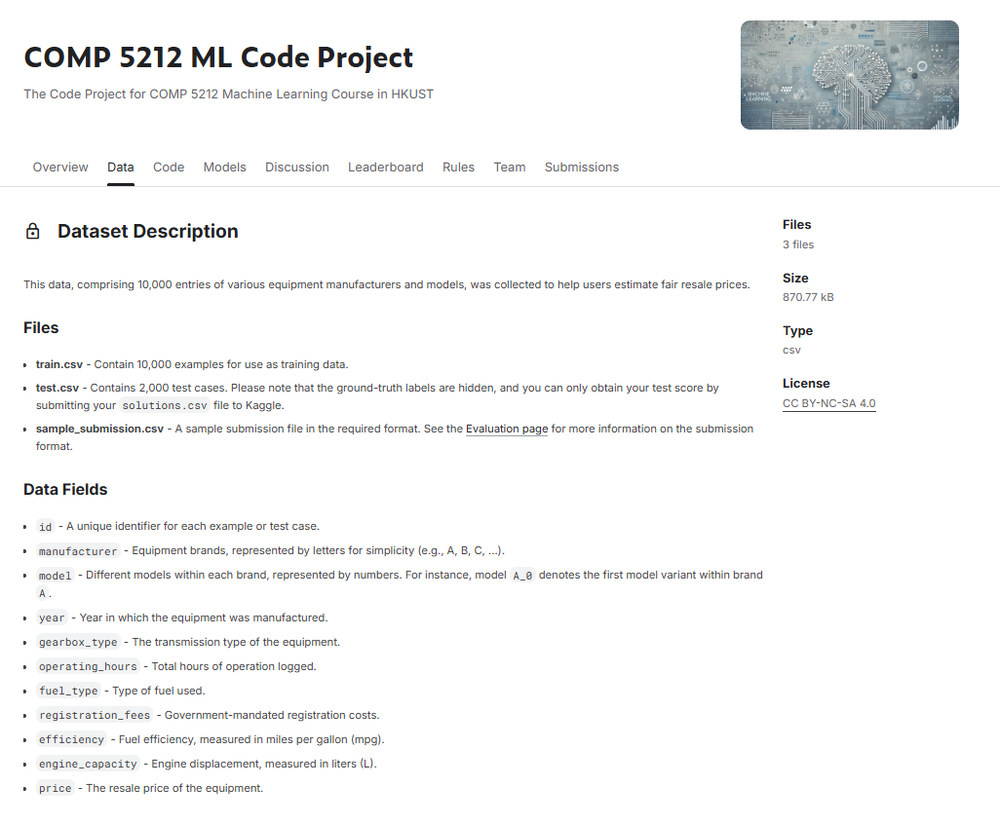

# ARL

**Paper:** Tingwei Chen, Yantao Wang, Hanzhi Chen, Zijian Zhao, Xinhao Li, Nicola Piovesan, Guangxu Zhu*, Qingjiang Shi, "[Modelling the 5G Energy Consumption using Real-world Data: Energy Fingerprint is All You Need](https://arxiv.org/abs/2406.16929)" (under way)

**Notice: ** The original data used in our paper cannot be publicly accessed due to copyright restrictions. Therefore, we implemented our method on a similar task instead.


=======


## Dataset

The dataset is sourced from the HKUST COMP 5212 course project ([Deed - Attribution-NonCommercial-ShareAlike 4.0 International - Creative Commons](https://creativecommons.org/licenses/by-nc-sa/4.0/)). A brief course report is provided for your reference.




## How to Run

To execute the program, please use the following command:

```python
python main.py --arl --norm
```


## Citation

```
@article{chen2024modelling,
  title={Modelling the 5G Energy Consumption using Real-world Data: Energy Fingerprint is All You Need},
  author={Chen, Tingwei and Wang, Yantao and Chen, Hanzhi and Zhao, Zijian and Li, Xinhao and Piovesan, Nicola and Zhu, Guangxu and Shi, Qingjiang},
  journal={arXiv preprint arXiv:2406.16929},
  year={2024}
}
```

